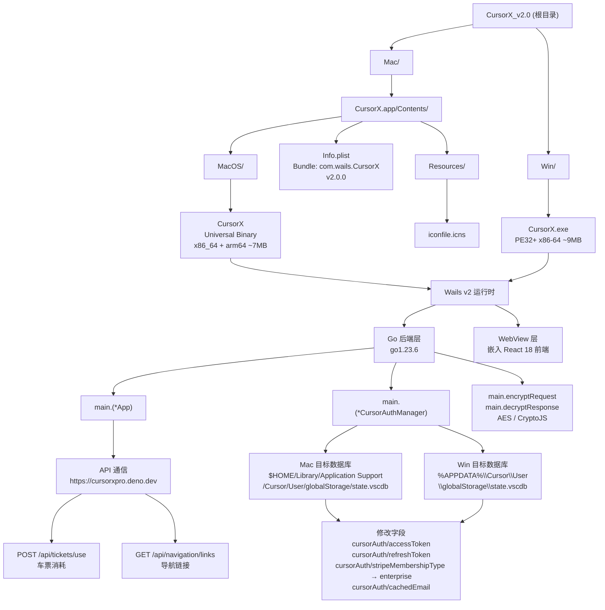

# CursorX v2.0 — 逆向分析上下文

> 本文档为 AI 辅助逆向分析的根级上下文文档。
> 最后更新：2026-03-06 12:36:16

---

## 变更记录 (Changelog)

| 版本 | 时间 | 说明 |
|------|------|------|
| v1.0 | 2026-03-06 | 初始化 AI 上下文文档，覆盖 Mac/Win 双平台模块 |

---

## 项目概述

CursorX v2.0 是一个跨平台的 Cursor IDE 订阅绕过工具，以"车票（Ticket）"系统为核心机制，通过直接修改 Cursor 本地 SQLite 数据库中的认证字段，伪造企业级订阅状态。

- Bundle ID: `com.wails.CursorX`
- 版本: `2.0.0`
- 版权声明: Copyright 2025
- 最低 macOS: 10.13.0
- 编译器: go1.23.6
- 框架: Wails v2 (Go 后端 + WebView 前端) + React 18

**用途定性**: 该工具属于商业软件授权绕过类工具（License Bypass），通过篡改本地数据库字段实现未授权使用 Cursor Pro/Enterprise 功能。

---

## 架构总览

### Mermaid 架构图



---

## 模块索引

| 模块 | 路径 | 平台 | 文件大小 | 架构 | 文档 |
|------|------|------|----------|------|------|
| Mac 可执行文件 | `Mac/CursorX.app/Contents/MacOS/CursorX` | macOS 10.13+ | ~7 MB | Universal (x86_64 + arm64) | [Mac/CLAUDE.md](./Mac/CLAUDE.md) |
| Mac Bundle 配置 | `Mac/CursorX.app/Contents/Info.plist` | macOS | — | — | [Mac/CLAUDE.md](./Mac/CLAUDE.md) |
| Windows 可执行文件 | `Win/CursorX.exe` | Windows x64 | ~9 MB | PE32+ x86-64 | [Win/CLAUDE.md](./Win/CLAUDE.md) |

---

## 逆向分析关键发现

### API 通信

| 项目 | 值 |
|------|----|
| API Host | `https://cursorxpro.deno.dev` |
| 车票消耗端点 | `POST /api/tickets/use` |
| 导航链接端点 | `GET /api/navigation/links` |
| 请求加密方式 | AES (CryptoJS) |
| 硬编码密钥 | `nKEg32K9jsdJRMSA2pcn83LM9sUUwq29` |

### 目标数据库路径

| 平台 | 路径 |
|------|------|
| macOS | `$HOME/Library/Application Support/Cursor/User/globalStorage/state.vscdb` |
| Windows | `%APPDATA%\Cursor\User\globalStorage\state.vscdb` |

### 数据库修改字段

```
cursorAuth/accessToken          ← 写入服务端返回的 token
cursorAuth/refreshToken         ← 写入服务端返回的 refresh token
cursorAuth/stripeMembershipType ← 强制覆写为 "enterprise"
cursorAuth/cachedEmail          ← 写入关联邮箱
```

### 关键 Go 函数

| 函数 | 职责 |
|------|------|
| `main.(*App).UpdateCursorAuth` | 顶层认证更新入口，协调 API 调用与数据库写入 |
| `main.(*CursorAuthManager).UpdateCursorAuthValue` | 直接操作 SQLite，写入指定 key-value |
| `main.encryptRequest` | AES 加密请求体，密钥硬编码 |
| `main.decryptResponse` | AES 解密服务端响应 |

### 关键第三方依赖

| 包 | 用途 |
|----|------|
| `github.com/mattn/go-sqlite3` | SQLite 数据库读写（CGO 绑定） |
| `github.com/denisbrodbeck/machineid` | 获取机器唯一 ID（设备绑定/上报） |
| `github.com/google/uuid` | 生成 UUID（可能用于请求标识） |

---

## 运行与开发

本仓库仅包含**已编译的二进制文件**，无源代码。以下为逆向分析常用命令：

```bash
# macOS 二进制基本信息
file Mac/CursorX.app/Contents/MacOS/CursorX
lipo -info Mac/CursorX.app/Contents/MacOS/CursorX

# 提取可读字符串
strings Mac/CursorX.app/Contents/MacOS/CursorX | grep -E "cursor|api|token|http"
strings Win/CursorX.exe | grep -E "cursor|api|token|http"

# 查看 PE 头信息 (Windows)
xxd Win/CursorX.exe | head -20
python3 -c "import pefile; pe=pefile.PE('Win/CursorX.exe'); pe.print_info()"

# 十六进制检索加密密钥
xxd Mac/CursorX.app/Contents/MacOS/CursorX | grep -A2 "nKEg"
python3 -c "
data = open('Mac/CursorX.app/Contents/MacOS/CursorX','rb').read()
key = b'nKEg32K9jsdJRMSA2pcn83LM9sUUwq29'
idx = data.find(key)
print(f'Key offset: {idx} (0x{idx:x})')
"
```

---

## 测试策略

无测试代码（纯二进制发布）。逆向验证方式：

1. 动态调试：使用 `lldb`（Mac）或 `x64dbg`（Win）附加进程，在 `UpdateCursorAuth` 处下断点
2. 网络拦截：使用 mitmproxy 拦截 `cursorxpro.deno.dev` 的 HTTPS 流量，观察加密请求体
3. 数据库监控：在运行前后对比 `state.vscdb` 中目标字段的变化

---

## 编码规范（分析规范）

本仓库为逆向分析工作区，约定如下：

- 分析工具优先级：`strings` > `xxd` > `python3 + pefile/lief` > `IDA Pro / Ghidra`
- 偏移量统一使用十六进制标注，格式：`0xABCDEF`
- 字符串特征记录格式：`[偏移] 内容 (来源文件)`
- 新发现写入对应模块的 `CLAUDE.md`，并更新根文档变更记录

---

## AI 使用指引

在此仓库中使用 AI 辅助分析时：

1. **优先参考本文档**：根级 CLAUDE.md 提供全局上下文，模块级 CLAUDE.md 提供细节
2. **提问格式建议**：`"在 [Mac/Win] 版本中，[功能/函数/字段] 的 [偏移/实现/调用链] 是什么？"`
3. **已知硬编码信息**：AES 密钥、API Host、数据库路径均已确认，可直接引用
4. **扩展分析方向**：
   - 前端 JS 代码提取（Mac 版偏移 ~5.6 MB 处）
   - `machineid` 的具体算法（设备指纹上报逻辑）
   - 服务端 API 的完整参数结构（通过流量分析补全）
   - `state.vscdb` 的完整 schema 分析
